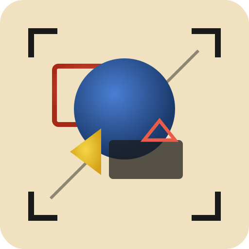

<p align="center">
  
</p>

# Fotos

AI-powered screenshot capture, annotation, and analysis tool built with Tauri 2.

## Features

- Screenshot capture (fullscreen, region, monitor, window) on Linux Wayland/X11 and Windows
- Annotation tools: arrow, rectangle, ellipse, text, blur, step numbers, freehand, highlight, crop
- Zoom controls and fit-to-page for precise annotation work
- Copy to clipboard and Save / Save As with native file-chooser dialog (Wayland portal)
- Toast notifications for copy, save, and save-as outcomes
- AI-powered OCR (Tesseract), PII auto-detection and blur, LLM vision analysis
- Secure API key management via the Settings modal (⚙): keys stored in the OS keychain (GNOME Keyring, KWallet), never in config files or localStorage
- MCP server (`fotos-mcp`) for AI agent integration:
    - **Autonomous Debugging**: Let agents "see" and fix errors.
    - **Accessibility Auditing**: Automate WCAG compliance checks.
    - **Privacy Redaction**: Automatically blur PII before sharing.
    - **Legacy Scraping**: Extract data from UI-only applications.
    - **Tutorial Generation**: Create annotated guides programmatically.
- System tray icon for quick capture access
- Structured logging via `RUST_LOG`
- Vanilla JS/HTML/CSS frontend with HTML5 Canvas — no web frameworks
- Flatpak packaging (`io.github.charly-vibes.fotos`)

## Installation

### Flatpak (recommended on Linux)

```bash
just setup-flatpak   # one-time: install GNOME SDK runtimes
just install         # build and install locally
```

### Homebrew (macOS and Linux)

```bash
brew tap charly-vibes/fotos
brew install fotos
```

### Scoop (Windows)

```powershell
scoop bucket add charly-vibes https://github.com/charly-vibes/scoop-bucket
scoop install fotos
```

## GNOME Shell Extension

A panel indicator extension is included in `gnome-extension/`. It adds a camera icon to the GNOME top bar with a popup menu for launching Fotos and triggering captures.

### Install the extension

```bash
just gnome-install   # compile schema + copy to ~/.local/share/gnome-shell/extensions/
```

Then enable it in the GNOME Extensions app (or `gnome-extensions enable fotos@io.github.charly-vibes`).
On Wayland you must log out and back in after installing. On X11, press `Alt+F2` → `r` to reload Shell.

### Global keybindings

| Shortcut | Action |
|---|---|
| `Ctrl+Shift+S` | Capture region |
| `Ctrl+Shift+A` | Capture fullscreen |

Shortcuts can be changed in GNOME Settings → Keyboard → Custom Shortcuts or via `gsettings`:

```bash
gsettings set org.gnome.shell.extensions.fotos capture-region-shortcut "['<Super>s']"
```

> **Known conflict**: `Ctrl+Shift+S` is also the in-app **Save As** shortcut. On Wayland, GNOME Shell
> intercepts global keybindings before they reach the app window, so Save As will not fire while the
> extension is enabled. If you need Save As, remap `capture-region-shortcut` to a different key in
> GNOME Settings.

### Package for distribution

```bash
just gnome-pack   # produces fotos-gnome-extension.zip
```

## Development

This project builds inside a **fedora distrobox** (required on Bluefin/immutable Fedora).

```bash
# One-time setup
just setup-distrobox    # create distrobox + install build deps
just setup-flatpak      # install Flatpak SDK runtimes (for packaging)

# Daily workflow
just dev                # cargo tauri dev (hot-reload)
just check              # cargo check (both crates)
just build              # cargo build --release
just test               # cargo test
just lint               # clippy -D warnings
just fmt                # rustfmt
just spec-validate      # validate all OpenSpec specs
just spec-list          # list all OpenSpec capabilities

# Packaging
just package            # build Flatpak
just install            # build + install Flatpak locally
just gen-cargo-sources  # regenerate flatpak/cargo-sources.json (run after Cargo.lock changes)
```

See the `justfile` for all available recipes.

## Current Implementation Status

Fotos is currently in active development (**tracer-bullet** project, **implement** phase).

| Component | Status | Implementation Details |
|---|---|---|
| **Capture** | Partial | Fullscreen, monitor (by index), and window (by id) capture on Linux and Windows. Region capture via in-app crop. |
| **Annotation** | Partial | Canvas engine with zoom/pan and history (undo/redo). Selection tool supports move/resize. |
| **AI Features** | Partial | OCR (Tesseract) and PII detection/auto-blur implemented. LLM vision is in progress. |
| **MCP Server** | Partial | Prompts are fully implemented. Tools and Resources are currently stubs. |
| **UI Shell** | Stable | Toolbar, canvas layers, basic panels, and Settings modal are functional. |
| **API Keys** | Stable | Stored in OS keychain via Settings (⚙). Supports Anthropic, OpenAI, and Gemini. |

See [docs/MCP.md](docs/MCP.md) for details on AI agent integration.

## Project Roadmap

Key features currently in the works (tracked via `beads`):

- **LLM Vision Integration**: Support for Claude, OpenAI, Gemini, and local Ollama.
- **Full MCP Support**: Implement all 6 MCP tools and resources with an IPC bridge to the main app.
- **Annotation Tools**: Complete the implementation of all 9 planned drawing tools.
- **Theme System**: Full support for light, dark, and system themes via CSS custom properties.

## Architecture

- `src-tauri/` — Rust backend (Tauri 2: capture, AI, file I/O, IPC, credentials, system tray)
- `src-mcp/` — MCP server binary (`fotos-mcp`, JSON-RPC 2.0 over stdio)
- `src-ui/` — Frontend (vanilla JS, HTML5 Canvas, ES modules)
- `openspec/specs/` — 9 capability specs defining all requirements
- `flatpak/` — Flatpak manifest (`io.github.charly-vibes.fotos`)

## License

Apache-2.0
